# Forklift

**Review 300 forks before lunch.**

Solari asked people to fork [solari-cookbook](https://github.com/solari-sdk/solari-cookbook), build something real, and post it. Someone on their side now has to open every fork, install it, run it, and see if it does what the README says. Forklift is that someone.

Paste the upstream repo and your judging criteria. Forklift finds every public fork, picks the ones that actually diverged, and for each one: opens a **Solari sandbox**, clones the fork, scans for committed secrets, installs, builds, then either serves it and sends a **recorded Solari browser** through it, or runs it to completion and keeps the transcript. Out comes an evidence card. Forklift does not rank anyone and never recommends a hire. It hands a human the facts.

> **Live floor:** _add your Railway URL here_ · **90-second walkthrough:** _add video link here_
>
> Built with Cursor. The fork this ships in: _add fork URL here_.

## What a reviewer sees

- `/` — one requisition slip: upstream repo, criteria (one per line), optional "your repo" for bay 05, optional single fork to inspect.
- `/floor/:jobId` — five bay doors filling in parallel over SSE. Lamp goes green, click the door.
- `/cards/:bayId` — the artifact (screenshot + replay for servers, terminal transcript for scripts), then run facts, criteria stamps (`YES` / `NO` / `LOOK`), Solari SDK usage found in the source, README-vs-reality, browser console and network errors, the diff against upstream, the full log. `EXPORT JSON` gives the same thing as a file.
- `/verify` — applicants paste their own fork URL and get the same card before they post.

Every card carries an **Evidence only · not a verdict** stamp. The two things Forklift will never print are a ranking and a hire/no-hire.

## How Solari is used

```mermaid
flowchart LR
  Slip["/ requisition slip"] --> Jobs["POST /api/jobs"]
  Jobs --> Discover["GitHub: list forks, compare ahead-by"]
  Discover --> Pool["bay pool (mapPool, N concurrent)"]
  Pool --> Sbx["Solari sandbox per bay"]
  Sbx --> Clone["git clone fork + fetch upstream"]
  Clone --> Scan["secret scan (fails closed)"]
  Scan --> Detect["detect stack: root, or the examples/ dir the fork changed"]
  Detect --> Install["install / build / test"]
  Install -->|server| Serve["start + previewUrl(port)"]
  Serve --> Browser["Solari browser, recording: true"]
  Browser --> Card["evidence card: screenshot, replay, console, network"]
  Install -->|script| Run["run once, 90s cap, no key injected"]
  Run --> Card
  Card --> Kill["sbx.kill() frees the slot"]
```



Two SDKs, used the way they are sold: sandboxes as disposable CI workers, browsers as the artifact.

**Sandboxes** ([`lib/solari/clients.ts`](lib/solari/clients.ts), [`lib/engine/pipeline.ts`](lib/engine/pipeline.ts))

- `SandboxClient.create({ template: "base", cpu: 2, memMb: 4096, lifecycle: { onTimeout: "kill" }, metadata: { app: "forklift", jobId, bayId } })`. Every box is tagged so reclaim can never touch a sandbox Forklift did not open.
- `sbx.git.clone(url, { depth: 1, branch, username, password })` for the fork; creds go per-call, nothing lands in `.git/config`. The upstream fetch for the diff runs as raw `git` with the token in a `GIT_CONFIG_*` extraheader, never in the remote URL.
- `sbx.files.write` / `readText` / `search` to drop the secret scanner in, read manifests, and find `@solarisdk` imports across the tree.
- `sbx.commands.run("sh", { args: ["-c", …], cwd, env, timeoutMs, onStdout, onStderr })` for install, build, test, and script runs. Output streams to the floor as it happens.
- `sbx.commands.start(...)` + `sbx.previewUrl(port)` for servers; Forklift polls the health path until it 200s.
- `sbx.kill()` on both success and failure. Not `pause()`: a paused box still holds a concurrency slot the next bay needs.
- `client.listAll({ metadata: { app: "forklift" } })` at job start to kill our own orphans from a crashed run.
- Optional: `sbx.snapshot()` once to build a warm worker image (`FORKLIFT_WARM_SNAPSHOT=1`). Off by default, see gotchas.

**Browsers** ([`lib/engine/browser.ts`](lib/engine/browser.ts))

- `new Solari({ apiKey }).launch({ recording: true })`, `newPage()`, `page.goto(previewUrl, { waitUntil: "domcontentloaded" })`, then the `demo` steps from the guest's `forklift.yaml` (goto / click / wait / screenshot).
- Console errors, page errors, and failed requests are collected off the page and land on the card.
- `browser.close()`, then poll `client.sessions.getReplayUrl(sessionId)` for the replay. `client.close()` so the process can exit.

**Desktops** are detected in submissions (`@solarisdk/desktop`) but Forklift does not use them itself. Depth on two surfaces beat a gimmick on three.

## The fork pool is mostly scripts, so Forklift handles scripts

The cookbook is `examples/<name>/` one-file programs that print and exit. Most forks touch one of those. A pipeline that only knows how to serve a port would produce empty cards for the majority of real submissions.

So [`lib/detect/stack.ts`](lib/detect/stack.ts) classifies each bay as `server` or `script`. If the repo root is bare, Forklift reads the diff, finds the `examples/` dir the fork added or changed, and reviews that. Scripts run once with a 90-second cap; the transcript and exit code are the artifact. If the script reads `SOLARI_API_KEY`, Forklift says so and does **not** judge the exit code: our key never goes into guest code, so a "missing key" failure is not the applicant's fault.

## `forklift.yaml`

When detection guesses wrong, a `forklift.yaml` at the repo root wins. If you spell out `install`, it owns the build step too:

```yaml
name: My thing
stack: node            # node | python
kind: server           # server | script
cwd: app               # optional subdirectory
install: npm ci && npm run build
start: npm run start
port: 3000
health: /api/health
tests: npm test
timeoutMinutes: 6      # capped at 8
demo:
  - action: goto
    path: /
  - action: wait
    text: Dashboard
    timeoutMs: 15000
  - action: click
    text: Run
  - action: screenshot
```

This repo ships one so Forklift can review itself as bay 05.

## Run it

```bash
cp .env.example .env.local
# SOLARI_API_KEY from console.getsolari.com
# GITHUB_TOKEN (public-repo read) once you pass ~60 GitHub calls an hour
npm ci
npm run dev
```

Open [http://localhost:3000](http://localhost:3000). **Review all forks** discovers the cookbook fork network, fills five doors, and pins this tree as bay 05. **Inspect one fork** does one URL.

Without `SOLARI_API_KEY` the floor runs as a **dry run**: fork discovery and GitHub ahead-by counts are real, everything else on the card reads *not measured*, and a hazard-striped band says so. A dry run never prints a `YES` or `NO`.

```bash
npm test          # vitest: detection, criteria, diff parsing, URL parsing
npm run typecheck
npm run lint
```

## Deploy (Railway)

One service plus a Postgres plugin. Set `DATABASE_URL`, `SOLARI_API_KEY`, `GITHUB_TOKEN`, `FORKLIFT_ACCESS_KEY`, and `FORKLIFT_BAY_CONCURRENCY` to whatever your Solari plan allows. `npm run start` binds `0.0.0.0:$PORT`; healthcheck is `GET /api/health`. Do not scale replicas: the bay pool and the SSE hub are in-process.

After one real contest run, put its job id in `NEXT_PUBLIC_SHOWROOM_FLOOR` and the landing page links visitors to a finished floor without handing out the access key.

## Threat model

- **Guest code is hostile.** Everything from a fork runs inside the Solari sandbox. The host only ever `fetch`es the preview URL and drives a cloud browser at it.
- **Our key never enters a guest.** Scripts that need `SOLARI_API_KEY` run without it and are marked, not failed. Bay 05 (Forklift reviewing itself) runs the nested app in dry-run mode for the same reason.
- **Committed secrets fail the bay** before `npm install` runs ([`lib/detect/scan_secrets.py`](lib/detect/scan_secrets.py): Solari, GitHub, AWS, OpenAI key shapes, private keys).
- **GitHub token** is passed per-call to `sbx.git` and as an extraheader env var to raw git; anything Forklift logs or stamps is scrubbed for it.
- **Writes fail closed in production.** `NODE_ENV=production` without `FORKLIFT_ACCESS_KEY` returns 503 on `POST /api/jobs` and logs why at boot. Read routes (floor, card, export) are public and UUID-scoped on purpose: the cards are the showroom.
- **Reclaim is scoped.** Only sandboxes tagged `app=forklift` are ever killed, and never ones this process is using.

## Gotchas the code works around

Each of these is a comment next to the code that handles it.

- **`kill()`, not `close()` or `pause()`, when you are done.** A paused sandbox still counts against concurrency. Bays kill on every exit path ([`pipeline.ts`](lib/engine/pipeline.ts)).
- **Concurrency caps are usually below five, and the 429 is deterministic.** Two floors started a minute apart failed with `Too many concurrent sessions` in production. Every sandbox now goes through one process-wide gate ([`slots.ts`](lib/engine/slots.ts)), `createReviewSandbox` waits up to `FORKLIFT_SLOT_WAIT_MS` polling every 10s (reclaiming our own orphans first), and the bay log names the org cap the gateway reports. `FORKLIFT_BAY_CONCURRENCY` (default 1) is how many bays hold a slot at once.
- **The `base` template ships Node 18.** Playwright, and so `@solarisdk/browser`, refuses to start on it, and Vite 7 wants `util.styleText`; two of the first three live forks died on boot for this reason. Forklift unpacks the Node major the guest asks for (`.nvmrc` / `engines.node`, default 22) into `/opt/node` and puts it first on `PATH` ([`pipeline.ts`](lib/engine/pipeline.ts) `ensureNode`). The log records `node v18.20.4 → v22.x`.
- **Dev servers bind loopback and ignore `HOST`.** Vite prints `Network: use --host to expose`, and the preview proxy 502s forever. After 20s with no answer Forklift probes `127.0.0.1:<port>` from inside the guest and, if something is there, starts a TCP forwarder on `0.0.0.0` and takes a new `previewUrl`.
- **Do not force `PORT` on a framework that has its own default.** Handing `PORT=5173` to a Vite app made its sibling API server (`concurrently` server+web) grab 5173 first and Vite died with `EADDRINUSE`. `PORT` is only set when the port came from `forklift.yaml` or the generic 3000 default.
- **Warm snapshots 409 "Not snapshottable" on the base template often enough that it is opt-in**, and the warm-up box itself eats a slot ([`clients.ts`](lib/solari/clients.ts)).
- **`networkidle` never settles on dev servers with HMR/websockets.** The browser pass waits for `domcontentloaded` plus a short beat ([`browser.ts`](lib/engine/browser.ts)).
- **Recording is per session and the replay upload is async.** `recording: true` at launch, then poll `getReplayUrl` for ~18s after `close()`.
- **Do not release a browser session twice.** `browser.close()` already releases; a second DELETE 404s and can wipe the screenshot.
- **Commands are not shell-interpreted.** Everything user-shaped goes through `sh -c` with the command in `args`.
- **`timeoutMs` is a rolling idle window**, so the pipeline keeps its own wall-clock budget (5 min default, `timeoutMinutes` in `forklift.yaml` up to 8).

## Limits, on purpose

- No ranking, no score, no hire button. `LOOK` means a person looks.
- One process. Restarting mid-job leaves bays in their last state; there is no resume.
- GitHub compare runs on the top 16 forks by stars, then the most-ahead five get bays. Quiet forks with big diffs can be missed; paste them into `/verify`.
- Regex secret scan. It catches the obvious shapes and nothing clever.

## Layout

```
app/                Next.js 16 app router: /, /floor, /cards, /verify, /api/*
lib/engine/         index (job runner, bay pool), pipeline (one bay), browser (recorded walk), fixture (dry run)
lib/solari/         SandboxClient / Solari factories, scoped reclaim, warm snapshot
lib/detect/         stack + example-dir detection, Solari usage, README vs reality, diff parsing, secret scan
lib/github/         fork discovery, compare, URL parsing
lib/store.ts        SQLite locally, Postgres on Railway
tests/              vitest over the pure parts
forklift.yaml       how Forklift reviews itself
```

MIT.
